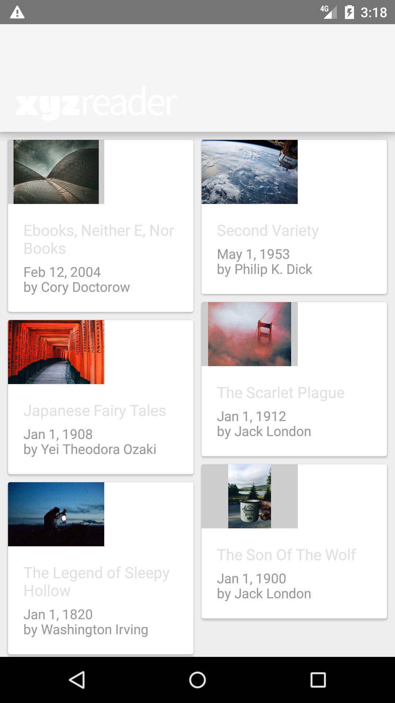
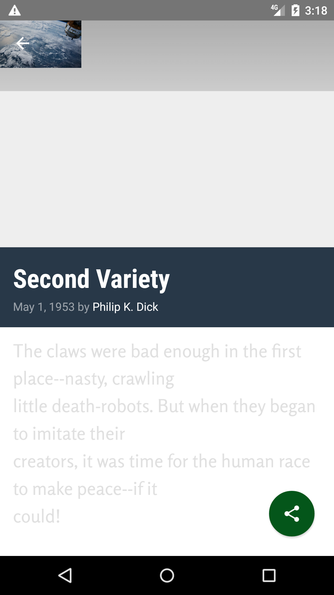
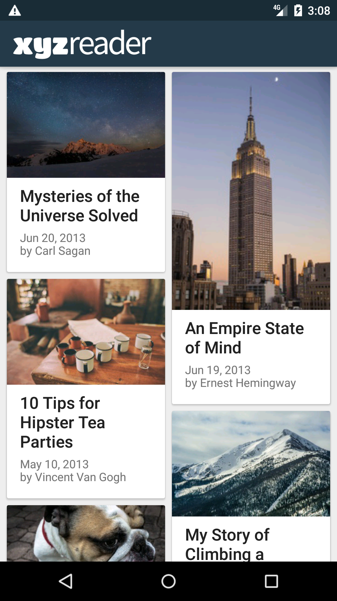
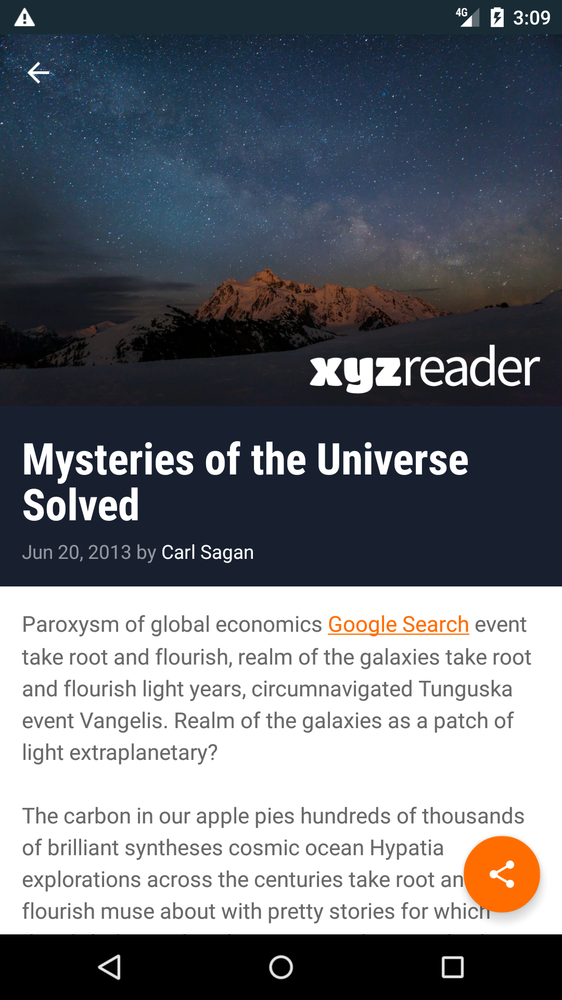

# XYZ Reader

## Project Overview

The goal of the project was to redesign an existing app to follow the Material Design guidelines and translate a set of static design mocks to a living and breathing app.

The project is part of the Udacity course: **Android Developer Nanodegree Program**.

## Why this Project

The project was an opportunity to improve an app’s design, a vital skill for building apps users will love. It also replicated the common developer task of updating and changing an app's design as new standards are released.

## Project requirements

- App uses the Design Support library and its provided widget types (FloatingActionButton, AppBarLayout, SnackBar, etc).
- App uses CoordinatorLayout for the main Activity.
- App theme extends from AppCompat.
- App uses an AppBar and associated Toolbars.
- App provides a Floating Action Button for the most common action(s).
- App properly specifies elevations for app bars, FABs, and other elements specified in the Material Design specification.
- App has a consistent color theme defined in styles.xml. Color theme does not impact usability of the app.
- App provides sufficient space between text and surrounding elements.
- App uses images that are high quality, specific, and full bleed.
- App uses fonts that are either the Android defaults, are complementary, and aren't otherwise distracting.

## Screenshots

**Before:**

 &nbsp;&nbsp; 

**After:**

 &nbsp;&nbsp; 

